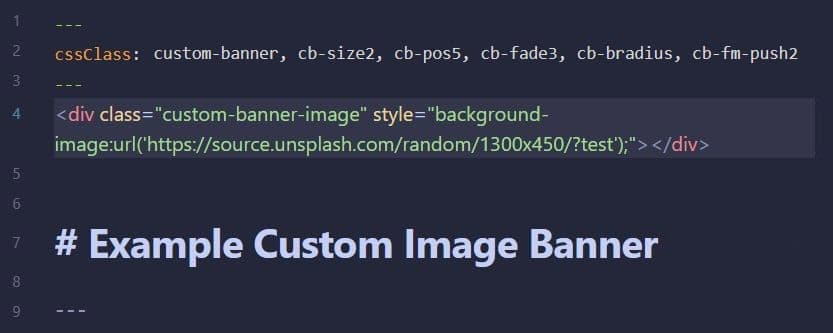

# 🚩 Obsidian Custom Banner Image
css snippet to allow for custom banner images per note in _Reading View_ (live preview not supported)

---

### Installation
copy the `custom-banner-image.css` file to your Obsidian snippets folder and enable the snippet in your Appearance preferences.

### Usage

1. Add this class definition to your note's Frontmatter
	```
	cssClass: custom-banner
	```
	
2. Add this `div` after your note's Frontmatter (replace <https://xyz.jpg> with your own image path)
	```
	<div class="banner-image" style="background-image:url('https://xyz.jpg');"></div>
	```

4. Optionally add these Frontmatter classes to further adjust properies like `image size`, `image display position`, `image fade percentage`, `image border radius`, and `frontmatter shift`
    - **banner image size** (_height_)
      ```
      cb-size1
      cb-size2
      cb-size3 [default]
      cb-size4
      cb-size5
      ```

    - **image position** (_shift image position in banner_)
      ```
      cb-pos1
      cb-pos2 [default]
      cb-pos3
      cb-pos4
      cb-pos5
      ```

     - **image fade** (_transparency used as image fades from top to bottom_)
       ```
       cb-fade1
       cb-fade2
       cb-fade3
       cb-fade4 [default]
       cb-fade5
       ```

     - **display solid image** (_no fade_)
       ```
       cb-solid
       ```
  
     - **add border-radius to image**
       ```
       cb-bradius
       ```

     - **push frontmatter** (_push frontmatter container down to give room to banner image_)
       ```
       cb-fm-push1
       cb-fm-push2
       cb-fm-push3
       cb-fm-push4
       cb-fm-push5 [default]
       ```

     - **auto expand frontmatter**
       ```
       cb-fm-auto-expand
       ```

     - **hide frontmatter**
       ```
       cb-fm-hidden
       ```

### Example




---

tip ⇢ unsplash API URL's are supported:  
https://source.unsplash.com/1600x900?search,terms,here

generate URL's for publicly shared google drive images here:  
https://github.com/jparkerweb/google-drive-image-url-generator

---

_note: live preview not supported_

---

### My Obsidian GitHub Projects

- 🚩 [Obsidian Custom Banner Image](https://github.com/jparkerweb/obsidian-custom-banner-image)
- 🦶 [Obsidian Rich Foot](https://github.com/jparkerweb/obsidian-rich-foot)
- 🌅 [Obsidian Image From Field](https://github.com/jparkerweb/obsidian-image-from-field/blob/main/README.md)
- 🌟 [Obsidian Element Enhancer](https://github.com/jparkerweb/obsidian-element-enhancer)
- ⏹ [Obsidian Bullet Cards](https://github.com/jparkerweb/obsidian-bullet-cards)
